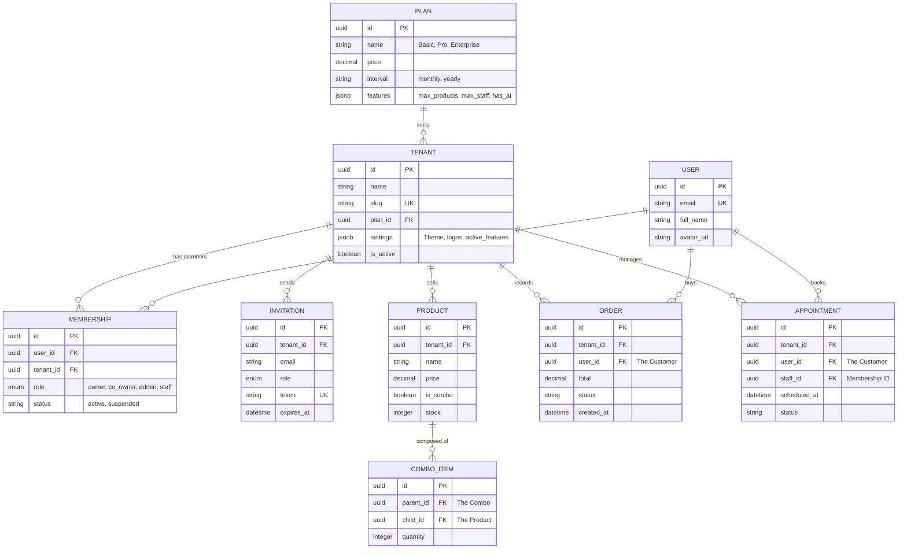

# Stora commerce diagram

```mermaid
erDiagram
    %% Identidad y SaaS
    USER ||--o{ MEMBERSHIP : "belongs to"
    TENANT ||--o{ MEMBERSHIP : "has members"
    PLAN ||--o{ TENANT : "limits"
    
    %% Negocio e Invitaciones
    TENANT ||--o{ INVITATION : "sends"
    TENANT ||--o{ PRODUCT : "sells"
    PRODUCT ||--o{ COMBO_ITEM : "composed of"
    
    %% Interacción Global (El Usuario como Cliente)
    USER ||--o{ ORDER : "buys"
    USER ||--o{ APPOINTMENT : "books"
    TENANT ||--o{ ORDER : "records"
    TENANT ||--o{ APPOINTMENT : "manages"

    USER {
        uuid id PK
        string email UK
        string full_name
        string avatar_url
    }

    TENANT {
        uuid id PK
        string name
        string slug UK
        uuid plan_id FK
        jsonb settings "Theme, logos, active_features"
        boolean is_active
    }

    MEMBERSHIP {
        uuid id PK
        uuid user_id FK
        uuid tenant_id FK
        enum role "owner, co_owner, admin, staff"
        string status "active, suspended"
    }

    PLAN {
        uuid id PK
        string name "Basic, Pro, Enterprise"
        decimal price
        string interval "monthly, yearly"
        jsonb features "max_products, max_staff, has_ai"
    }

    INVITATION {
        uuid id PK
        uuid tenant_id FK
        string email
        enum role
        string token UK
        datetime expires_at
    }

    PRODUCT {
        uuid id PK
        uuid tenant_id FK
        string name
        decimal price
        boolean is_combo
        integer stock
    }

    COMBO_ITEM {
        uuid id PK
        uuid parent_id FK "The Combo"
        uuid child_id FK "The Product"
        integer quantity
    }

    ORDER {
        uuid id PK
        uuid tenant_id FK
        uuid user_id FK "The Customer"
        decimal total
        string status
        datetime created_at
    }

    APPOINTMENT {
        uuid id PK
        uuid tenant_id FK
        uuid user_id FK "The Customer"
        uuid staff_id FK "Membership ID"
        datetime scheduled_at
        string status
    }
```
